# 容器管理与容器监控

## 容器管理工具Rancher

### 什么是Rancher

​	[官网](https://www.cnrancher.com/ )

​	Rancher是一个开源的企业级全栈化容器部署及管理平台。Rancher为容器提供一揽子基础架构服务：CNI兼容的网络服务，存储服务，主机管理，负载均衡，防护墙...

​	Rancher让上述服务跨越公有云，私有云，虚拟机，物理机环境运行，真是实现一键式应用部署和管理。

### Rancher安装

1. 下载Rancher镜像

   ```cmd
   docker pull rancher/server
   ```

2. 创建Rancher 容器

   ```cmd
   docker run -d --name rancher --restart=always -p 9090:8080 rancher/server
   ```

   - restart：重启策略

     - no，默认策略，在容器退出时不重启容器

     - on-failure，在容器非正常退出时(退出状态非0)，才会重启容器

     - on-failure:3，在容器非正常退出时重启容器，最多重启3次

- always：在容器退出时总是重启容器
  - unless-stopped：在容器退出时总是重启容器，但是在不考虑在Docker守护进程启动时就已经停止了容器

3. 在浏览器输入地址：http://192.168.x.x:9090 即可看到页面，如果没有反应多等一会即可

   点击Got It 进入主界面

4. 切换至中文界面，看自己选择

   点击右下角的English在弹出菜单中选择中文

### 添加环境

​	Rancher支持将资源分组归属到多个环境。每个环境具有自己独立的基础架构资源及服务，并由一个或多个用户，团队或组织所管理。

​	例如：您可以创建独立的"开发"，"测试"及"生产"环境以确保环境之间的安全隔离，将"开发"环境的访问权限赋予全部人员，单限制"生产"环境的访问权限给一个小的团队。

1. 选择"Default - 环境管理"菜单
2. 填写名称，点击"创建"按钮
3. 添加测试环境和生产环境
4. 您可以通过点击logo右侧的菜单在各种环境下切换

### 添加镜像库

选择Custom，输入ip地址

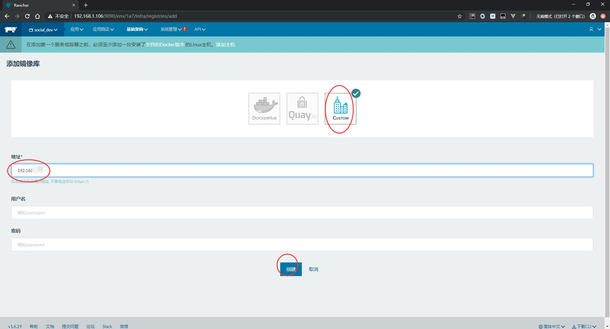

### 添加主机

1. 选择基础架构 - 主机菜单 - 点击添加主机

   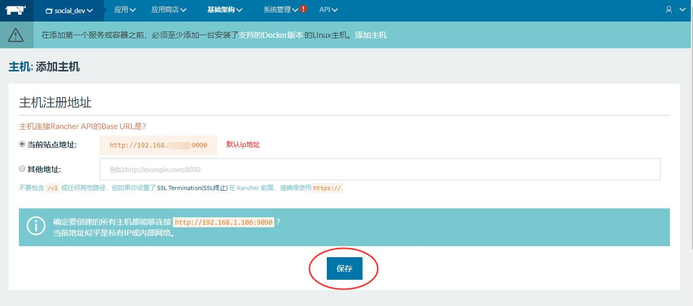

2. 拷贝脚本

   

3. 在虚拟机上运行脚本

   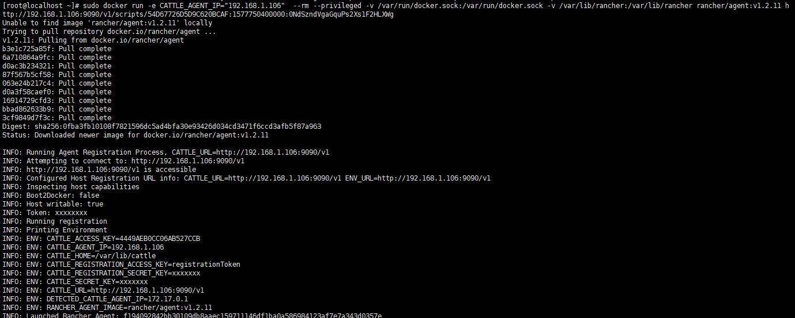

4. 点击关闭按钮后，会看到界面中显示此主机。可以方便地管理主机的每个日期的开启和关闭

   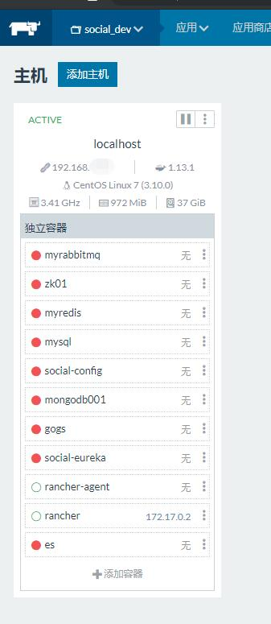

### 添加应用

点击应用 - 全部(或用户)，点击"添加应用"按钮

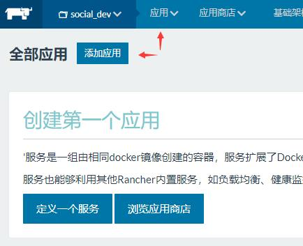

填写名称和描述，点击"创建"按钮，列表中增加了新增的应用

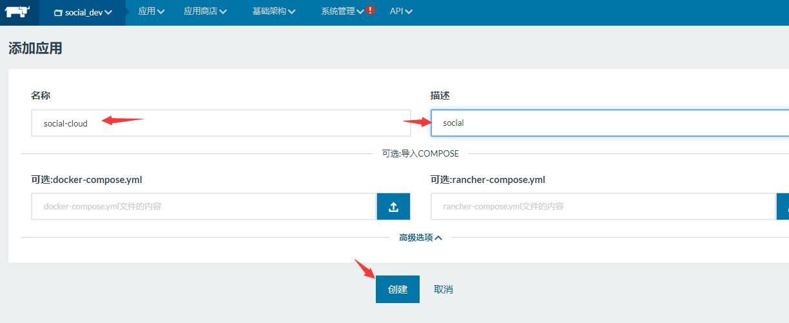


### 应用部署

1. mysql部署

   镜像：docker.io/mysql:5.7.28，这个镜像选择docker 里面下载好的如果没有下载好要选择创建前总是拉取镜像的复选框

   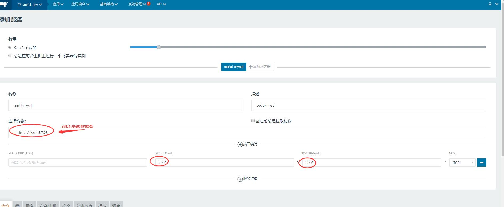

2. 添加环境变量 MYSQL_ROOT_PASSWORD=root

   

   上面创建等于

   ```dockerfile
   docker run ‐di ‐‐name mysql ‐p 3306:3306 ‐e MYSQL_ROOT_PASSWORD=root docker.io/mysql:5.7.28
   ```

3. 查看容器

   

### 微服务部署

打包上传的镜像，部署项目


## 扩容与缩容

### 扩容

1. 在Rancher将创建的social-base(基础信息微服务)删除

2. 重新创建social-base-service，不设置端口映射，创建完，这个容器为1

3. 在选择菜单API - WebHooks，点击"添加接收器"按钮，填写名称等信息，选择要扩容的服务，点击创建按钮

   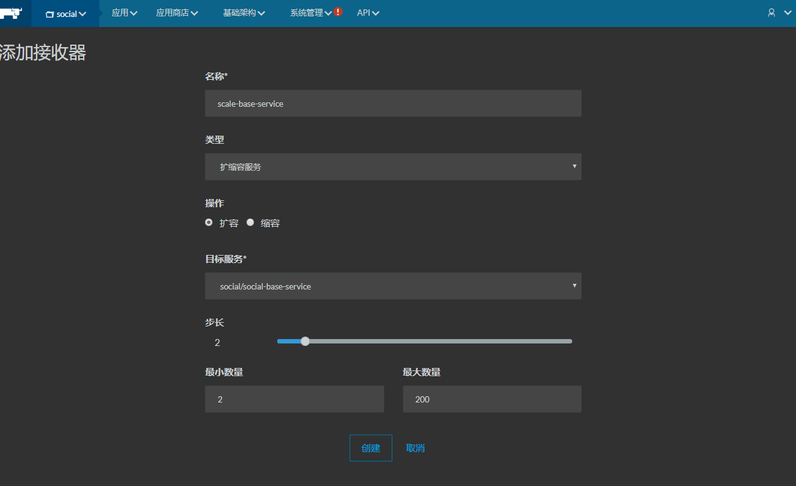

4. 接收器列表中新增了一条记录，点击触发将地址复制

   

5. 使用postman测试：按post方式提交

   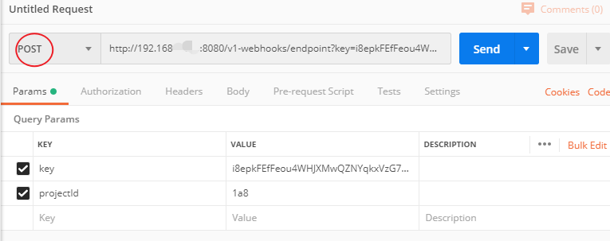

6. 测试后，发现容器由原来的1个变成了3个

   

   打开eureka，发现服务也有三个

   

### 缩容

刚才实现了扩容，那么如何减少容器的数量

1. 添加接收器，选择缩容，步长为1表示每次递减1个，点击创建按钮

   

2. 接收器列表中新增了一条记录，点击触发将地址复制

3. 使用postman测试：按post方式提交

4. 测试后，发现容器由原来的3个变成了1个

## influxDB

### 什么是influxDB

​	influxDB是一个分布式时间列数据库。cAdvisor仅仅显示实时信息，但是不存储监视数据。因此我们需要提供时序数据用于存储cAdvisor组件所提供的监控信息，以便显示除实时信息之外的时序数据。

### influxDB安装

1. 下载镜像

   ```dockerfile
   docker pull tutum/influxdb
   ```

2. 创建容器

   ```dockerfile
   docker run -di \ -p 8083:8083 \ -p 8086:8086 \ --expose 8090 \ --expose 8099 \ --name influxsrv \ tutum/influxdb
   ```

   

   端口概述：8083：web访问，8086：数据写入端口

3. 打开浏览器 http:192.168.x.x:8083

### influxDB常用操作

1. 创建数据库

   
   
2. 查看数据库

   
   
3. 创建用户并授权

   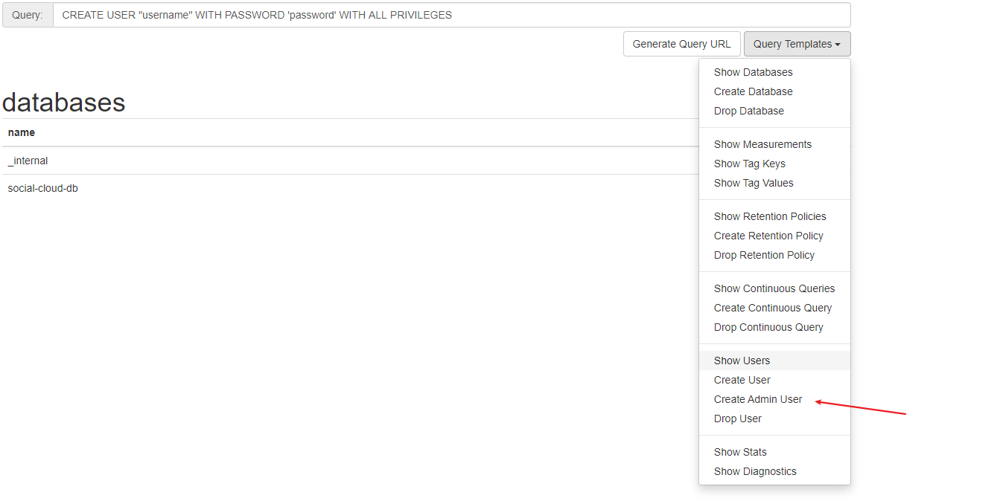

4. 查看用户

   

5. 用户授权

   ```cmd
   grant all privileges on cadvisor to cadvisor
   grant WRITE on cadvisor to cadvisor
   grant READ on cadvisor to cadvisor
   ```

6. 查看采集的数据

   切换到social-cloud-db数据库，使用命令查看采集的数据，现在还没有数据，如果想采集系统的数据，需要使用Cadvisor软件来实现

   

## cAdvisor

### 什么是cAdvisor

​	Goole开源的用于监控基础设施应用的工具，它是一个强大的监控工具，不需要任何配置就可以通过运行在Docker主机上的容器来监控Docker容器，而且可以监控Docker主机。

### cAdvisor安装

1. 下载镜像

   ```dockerfile
   docker pull google/cadvisor
   ```

2. 创建容器

   第一种创建时候把里面输入添加到influxDB数据库中，命令里面的social-cloud-db是influxdb里面的数据库，如果不指定就选择第二种方法

   ```dockerfile
   docker run --volume=/:/rootfs:ro --volume=/var/run:/var/run:rw --volume=/sys:/sys:ro --volume=/var/lib/docker/:/var/lib/docker:ro --publish=8079:8080 --detach=true --link influxsrv:influxsrv --name=cadvisor google/cadvisor -storage_driver=influxdb -storage_driver_db=social-cloud-db -storage_driver_host=influxsrv:8086
   ```

   第二种

   ```dockerfile
   docker run \
     --volume=/:/rootfs:ro \
     --volume=/var/run:/var/run:rw \
     --volume=/sys:/sys:ro \
     --volume=/var/lib/docker/:/var/lib/docker:ro \
     --publish=8079:8080 \
     --detach=true \
     --name=cadvisor \
     --net=host \
      google/cadvisor:latest
   ```

   

3. 如果启动运行不了，请输入以下命令

   ```cmd
   mount -o remount,rw '/sys/fs/cgroup'
   ln -s /sys/fs/cgroup/cpu,cpuacct /sys/fs/cgroup/cpuacct,cpu
   ```

4. 打开浏览器访问地址 

   http://192.168.x.x:8077/containers/ 

   性能指标含义参照如下地址

   https://blog.csdn.net/ZHANG_H_A/article/details/53097084

   再次查看influxDB，发现一家有很多数据被采集进去了


## Grafana

### 什么是Grafana

​	Grafana是一个可视化面板(Dashboard)，有非常漂亮的图标和布局的展示，功能齐全的度量仪表盘和图形编辑器。支持Graphite，zabbix，InfluxDB，Prometheus和OpenTSDB作为数据源。

​	Grafana主要特征：灵活丰富的图形化选择。可以混合多种风格。支持白天和夜间模式；支持多个数据源。

### Grafana安装

1. 下载镜像

   ```dockerfile
   docker pull grafana/grafana
   ```

2. 创建容器，里面的INFLUXDB_USER 要选择 influxdb 存在的用户

   ```dockerfile
   docker run -d -p 3001:3000 -e INFLUXDB_HOST=influxsrv -e INFLUXDB_PORT=8086 -e INFLUXDB_NAME=cadvisor -e INFLUXDB_USER=social ‐e INFLUXDB_PASS=cadvisor --link influxsrv:influxsrv --name grafana grafana/grafana
   ```

3. 打开浏览器访问 http:192.168.x.x:3001，用户名密码都是admin

4. 登录后提示修改密码，可以选择不修改

   

### Grafana的使用

#### 添加数据源

1. 点击设置，DataSource

   

2. 添加data source

   

3. 选择InfluxDB

   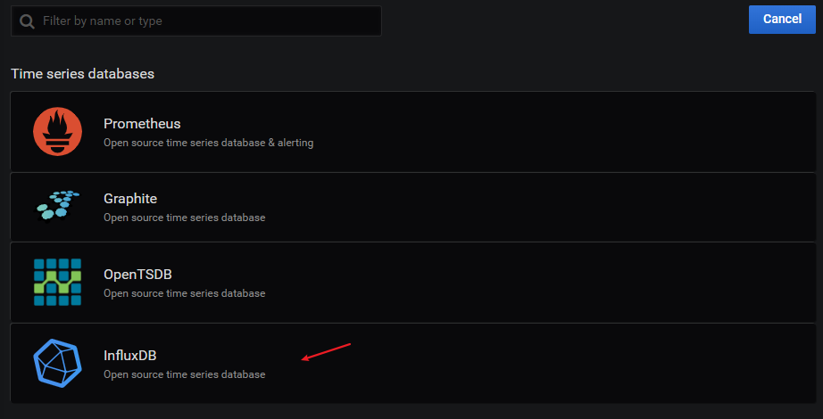

4. 保存

   

   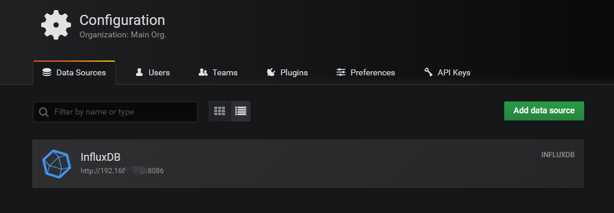

#### 添加仪表盘

1. 选择Dashboards --Manager

   

2. 点击"添加"按钮

3. 点击 Choose Visualization - > Graph 图标

4. 出现图表的界面，点击左边栏 选择General

   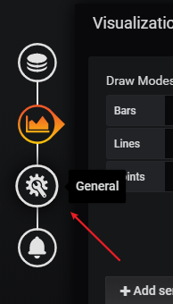

5. 定义标题等基础信息

   

6. 设置查询的信息为内存，指定容器的名称

   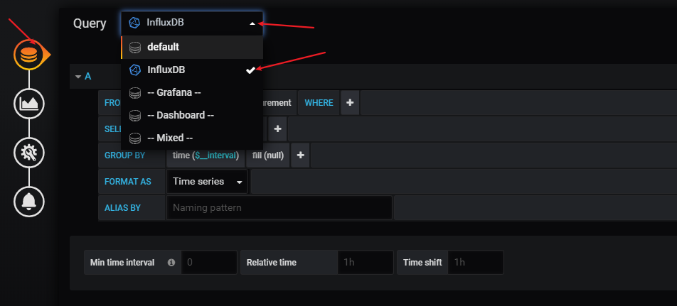

   

   

   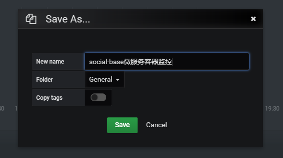

#### 添加预警通知

1. 选择菜单 alerting - > Notification channels -> Add channel 按钮

   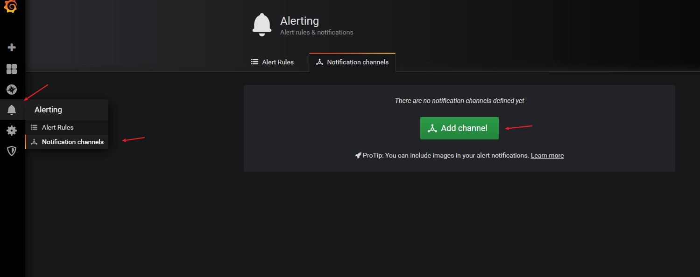

2. 填写名称，选择类型为webhook，填写钩子地址

   

   这个钩子地址是之前对base微服务扩容的地址

   

3. 点击SendTest 测试，观察social-base是否增加容器

   

4. 点击save保存

   

#### 仪表盘预警设置

1. 再次打开刚才的编辑的仪表盘，点击Create Alert，设置预警线

   如果找不到，就点标题的那个Edit就可以

   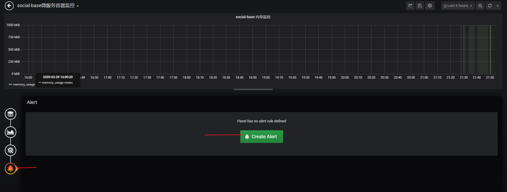

2. 选择通知，添加信息，保存更改

   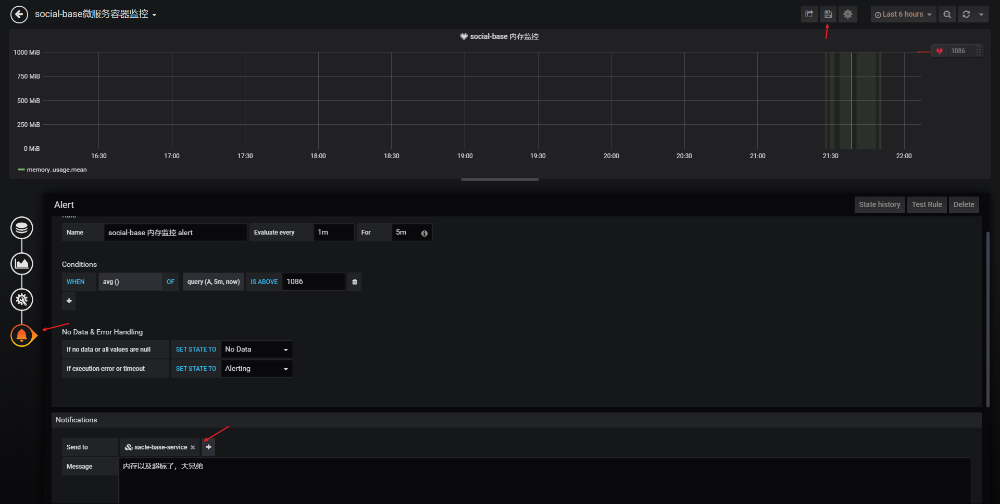

   
