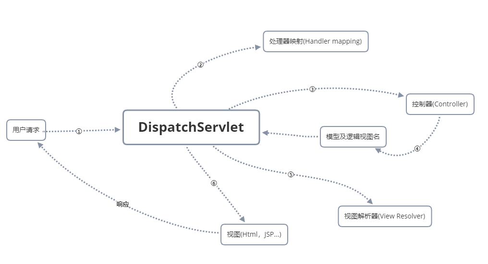

# 跟踪 Spring MVC 的请求

​	用户请求浏览器①，会带用户所请求内容的信息，至少会包含请求的URL，可能会带其他的信息，比如用户提交的表单信息。
​	请求的是Spring的DispatcherServlet。Spring MVC 所有的请求都会通过一个前端控制器(Controller)Servlet。前端控制器是常用的Web应用程序模式，在这里将请求给应用程序的其他组件来执行实际的处理，在Spring MVC中，DispatcherServlet就是前端控制器。
​	DispatcherServlet的任务将请求发送给Spring MVC控制器(Controller)。控制器是一个用于处理请求的Spring的组件。在典型的应用程序中可能会有多个控制器，DispatcherServlet需要知道应该将请求发送给哪个控制器。所以DispatcherServlet会查询一个或多个处理器映射(Handler mapping)②来确定请求的下一站在哪。处理器映射会根据请求所带的URL信息来进行。
​	一旦选择了合适的控制器，DispatcherServlet会将请求发送给选中的控制器③。到了控制器，请求会卸下用户提交的信息并等待控制器处理这些信息。(良好的控制器处理工作很少，把业务逻辑给一个服务或者多个服务对象进行处理。)
​	控制器在完成逻辑处理后，通常会产生一些信息，这些信息需要返回给用户并在浏览器上显示。这些信息被称为模型(Model)。不过给用户返回原始的信息是不够的，所以信息需要发送给一个视图(View)，通常会是Html，JSP等等。
​	控制器所做的最后一件事就是将模型数据打包，并且标示出用于渲染输出的视图名。它会将请求模型和视图名发送给DispatcherServlet④。
​	控制器不会与特定的视图相耦合，传递给DispatcherServlet的视图名并不直接表示某个JSP。实际上，它不能确定视图就是JSP。相反它传递了一个逻辑名称，这个名字将会用来查找产生结果的真实视图。DispatcherServlet将会使用视图解析器(View Resolver)⑤来将逻辑视图名匹配为一个特定的视图实现，它可能是也可能不是JSP。
​	DispatcherServlet知道由哪个视图渲染结果，那请求的任务基本上就完成了。它的最后一站是视图的实现⑥，在这里它给的模型数据。请求的任务就完成了。视图将使用模型数据渲染输出，这个输出会通过响应对象传递给客户端⑦。
